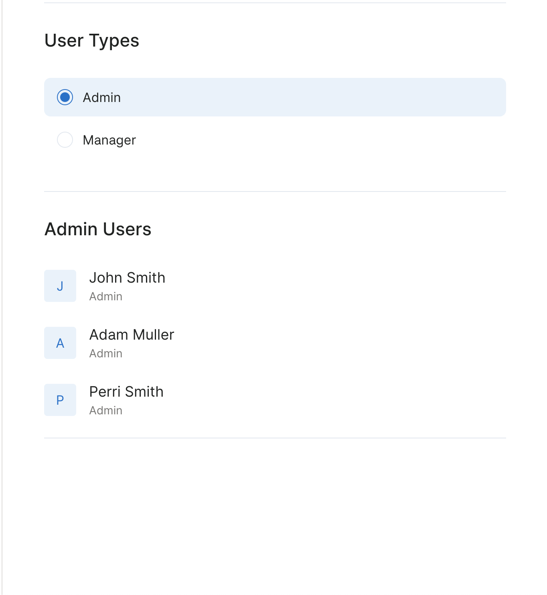

# Zeller Customer Management App

A React Native application for managing customer data with filtering capabilities for Admin and Manager user types.

## Project Overview

This application allows users to view and filter customers based on their roles (Admin/Manager). It consists of two main parts:

1. **Frontend Application** - A React Native app built with TypeScript
2. **Mock GraphQL Server** - A Node.js server providing customer data through GraphQL API

## Features

- View list of customers 
- Filter customers by role (Admin/Manager)
- Responsive UI with clean, modern design
- Unit tests for components and hooks

## Screenshots



## Architecture

### Frontend

The frontend application follows a structured architecture:

- **Components**: Reusable UI components
- **Hooks**: Custom React hooks for data fetching and business logic
- **Services**: API integration and data fetching

### Backend

The mock server provides GraphQL endpoints that return customer data.

## Setup & Installation

### Prerequisites

- Node.js v14.x or higher
- npm or yarn
- React Native development environment

### Installation Steps

1. **Clone the repository**

```bash
git clone https://github.com/yourusername/ZellerAssesmentNagendra.git
cd ZellerAssesmentNagendra
```

2. **Install dependencies**

```bash
# Install frontend dependencies
cd frontendApp
npm install

# Install backend dependencies
cd ../mock-server
npm install
```

3. **Start the mock server**

```bash
cd mock-server
npm start
```

The server will run on http://localhost:9002/

4. **Start the frontend application**

In a new terminal:

```bash
cd frontendApp
npm start
```

For running on a physical device, use:

```bash
npm run android
# or
npm run ios
```

## API Documentation

The application uses GraphQL API with the following schema:

### Customer Data Model

```graphql
type Customer {
  id: ID!
  name: String
  email: String
  role: String
}

type CustomerConnection {
  items: [Customer]
}

type Query {
  listZellerCustomers: CustomerConnection
  getZellerCustomer(id: ID!): Customer
}
```

### Available Queries

- **listZellerCustomers**: Returns a list of all customers
- **getZellerCustomer**: Returns a specific customer by ID

## Testing

The project includes comprehensive tests for components, hooks, and services.

### Running Tests

```bash
cd frontendApp
npm test
```

### Test Coverage

- Component tests verify UI rendering and user interactions
- Hook tests ensure proper data fetching and state management
- Integration tests validate the complete workflow

## Development Notes

- The application uses a mock server for development, but can be connected to a real backend
- The 10.0.2.2 address is used in the API configuration to allow Android emulators to connect to the host machine

## Future Enhancements

- Add customer creation functionality
- Implement authentication
- Add sorting and pagination for customer list
- Improve UI/UX with animations
